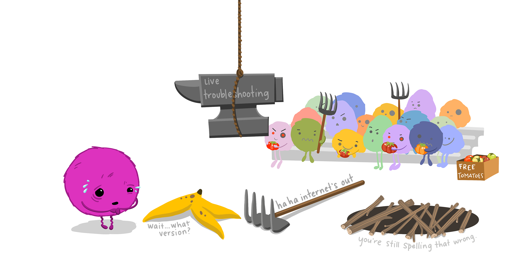

```{r, load_refs, echo=FALSE, cache=FALSE, message=FALSE}
library(RefManageR)
library(icons)
library(readxl)
library(tidyverse)
library(patchwork)
library(flextable)
library(sessioninfo)

knitr::opts_chunk$set(
  fig.asp = 9/16,
  fig.align = 'center',
  echo = F,
  out.width = "95%",
  dpi= 300)
 
top_icon = function(x) {
  icons::icon_style(
    icons::fontawesome(x),
    position = "fixed", top = 10, right = 10
  )
}
```

class: title-slide
background-image: url("assets/title-image2.jpg")
background-position:  100% 50%
background-size: 100% 100%

# .text-shadow[.black[Introduction to Rmarkdown]]
<br><br><br><br><br><br><br><br><br><br>
### .text-shadow[.white[<br><br><br> &nbsp;Dr Kristy Robledo <br> `r icon_style(fontawesome("twitter"), fill="blue")` @kristyrobledo]]
---
class: center

# .brand-red[RECAP: What can Stata do?]


  .center[

]
<br>

[Slides here](https://github.com/kristyrobledo/Intro_Rmarkdown/blob/main/STATA/ACTA%20STInG%20Stata%20Workshop_15022023_Anurika%20De%20Silva.pdf)


[Code here](https://github.com/kristyrobledo/Intro_Rmarkdown/tree/main/STATA/Stata%20Programs)

---
# .brand-red[What can Rmarkdown do?]

  .center[

]


.font60[
Courtesy: Alison Horst [Artwork by @allison_horst](https://allisonhorst.com/) 
]


???


---
# **For example: A reproducibility receipt**

.pull-left[
You can write something like this in Rmarkdown:

```{r, echo=TRUE, eval=FALSE}
sessioninfo::package_info() %>%
  unclass() %>%
  as_tibble() %>%
  filter(attached==TRUE) %>%
  select(package, ondiskversion, date) %>%
  rename(version=ondiskversion) %>%
  flextable() %>%
  autofit()
  
```

And it will come out like this in the document:
]

--

.pull-right[

```{r, tab.cap = "R packages used in analyses and reporting"}
sessioninfo::package_info() %>%
  unclass() %>%
  as_tibble() %>%
  filter(attached==TRUE) %>%
  select(package, ondiskversion, date) %>%
  rename(version=ondiskversion) %>%
  flextable() %>%
  line_spacing(space=0.7, part="all") %>%
  autofit()
  
```
]
---


# .brand-red[What outputs can I create?]

.pull-left[

.content-box-yellow[

Documents

- PDF
- html
- **word**
- books

+more

Slides

- html
- powerpoint
- beamer

]
]


--

.pull-right[
 .content-box-red[

Other

- dashboards (flexdashboard)
- notebooks
- websites 
- shiny apps

]


[See here for examples](https://rmarkdown.rstudio.com/gallery.html) 

]


???
today we are going to focus on word outputs, specifically using the officedown package
---

# .brand-red[Today we are focusing on:]
.pull-left[

.content-box-yellow[

- creating a word document
- basic formatting in markdown
- including code in report
- including tables in report
- including graphics in report
- cross reference tables and figures
- in line reporting

]
]

--

.pull-right[




.font60[
Courtesy: Alison Horst [Artwork by @allison_horst](https://allisonhorst.com/) 
]
]

???

- officedown package
- gtsummary package
- tidyverse approach to code
- tips and tricks along the way

---
class: sydney-blue

# **Some tips with Word + Rmarkdown:**

- knit regularly and check (esp figure size)

--

- use the code chunk option for table captions: 'tab.cap = "Insert table caption"'

--

- and code chunk option: 'tab.id="shortname"' with no symbols so you get "table 1"

--

- use global code chunk option "fig.cap = TRUE" to make sure Figure captions work

--

- "Clear knitr cache" is your friend, as is google and stackoverflow/github. 

--

- if you are going to PDF it.... create a PDF document! .fn[1]

--

- if you want some cool features like interactive graphs & "sort-able" tables, try html!


.footnote[[1] Will need latex or tinytex installed! [Instructions here](https://bookdown.org/yihui/rmarkdown-cookbook/install-latex.html)]

---
# .brand-blue[**Resources:**]

.font130[**Rmarkdown**] 

- [Rmarkdown cheatsheet](https://www.rstudio.org/links/r_markdown_cheat_sheet)
- [Rmarkdown reference](https://www.rstudio.com/wp-content/uploads/2015/03/rmarkdown-reference.pdf)
- [Rmarkdown cookbook](https://bookdown.org/yihui/rmarkdown-cookbook/)

--

.font130[**gtsummary** @statistishdan] 

- [gtsummary help with lots of examples](https://www.danieldsjoberg.com/gtsummary/)
- [gtsummary presentation](http://www.danieldsjoberg.com/gtsummary-weill-cornell-presentation/#1)
- super responsive on stackoverflow

--

.font130[**officedown** @DavidGohel] 

- [Officedown for word](https://ardata-fr.github.io/officeverse/officedown-for-word.html)


???


---
class: sydney-red
background-image: url(assets/USydLogo-white.svg),url(https://upload.wikimedia.org/wikipedia/commons/b/be/Sharingan_triple.svg)
background-size: 260px,100px
background-position: 5% 95%,4% 70%

# Thanks!

.pull-right-2[
.pull-up[
 
]

.pull-down[

<a href="mailto:kristy.robledo@sydney.edu.au">
.white[`r icons::fontawesome("paper-plane")` kristy.robledo@sydney.edu.au]
</a>

<a href="https://kristyrobledo.github.io/Intro_Rmarkdown/">
.white[`r icons::fontawesome("link")` kristyrobledo.github.io/Intro_Rmarkdown/]
</a>

<a href="http://twitter.com/kristyrobledo">
.white[`r icons::fontawesome("twitter")` @kristyrobledo]
</a>

<a href="http://github.com/kristyrobledo">
.white[`r icons::fontawesome("github")` @kristyrobledo]
</a>

]]

???
sharingan
